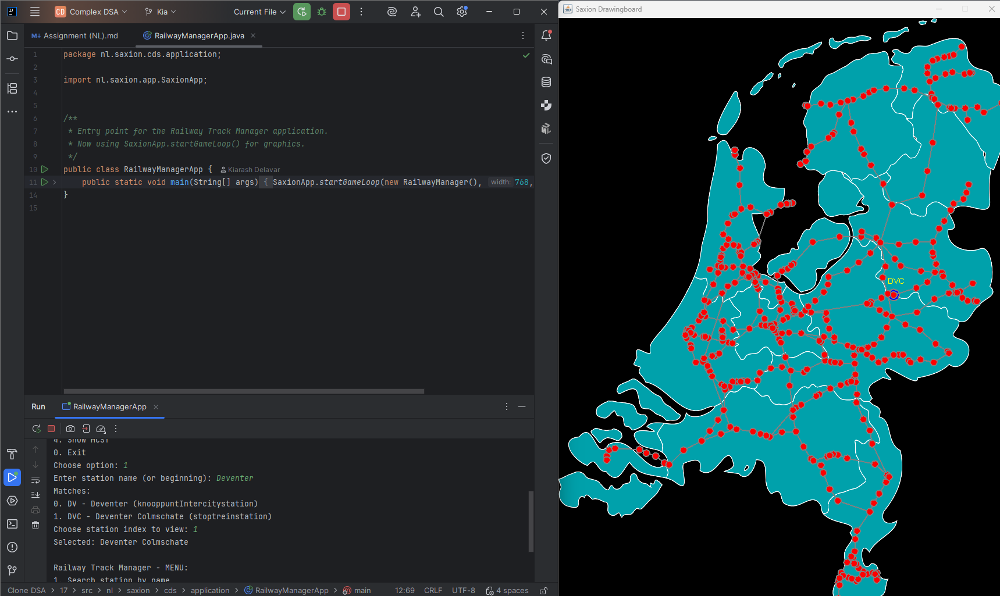
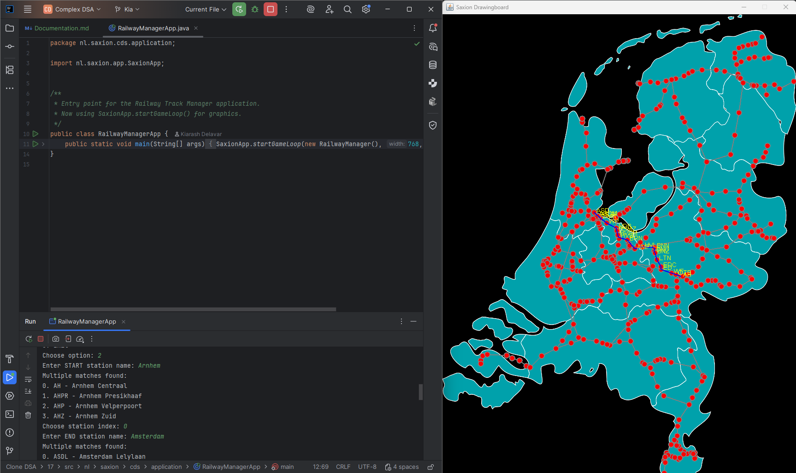
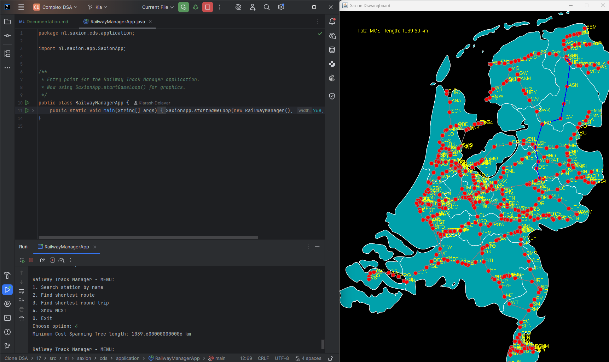
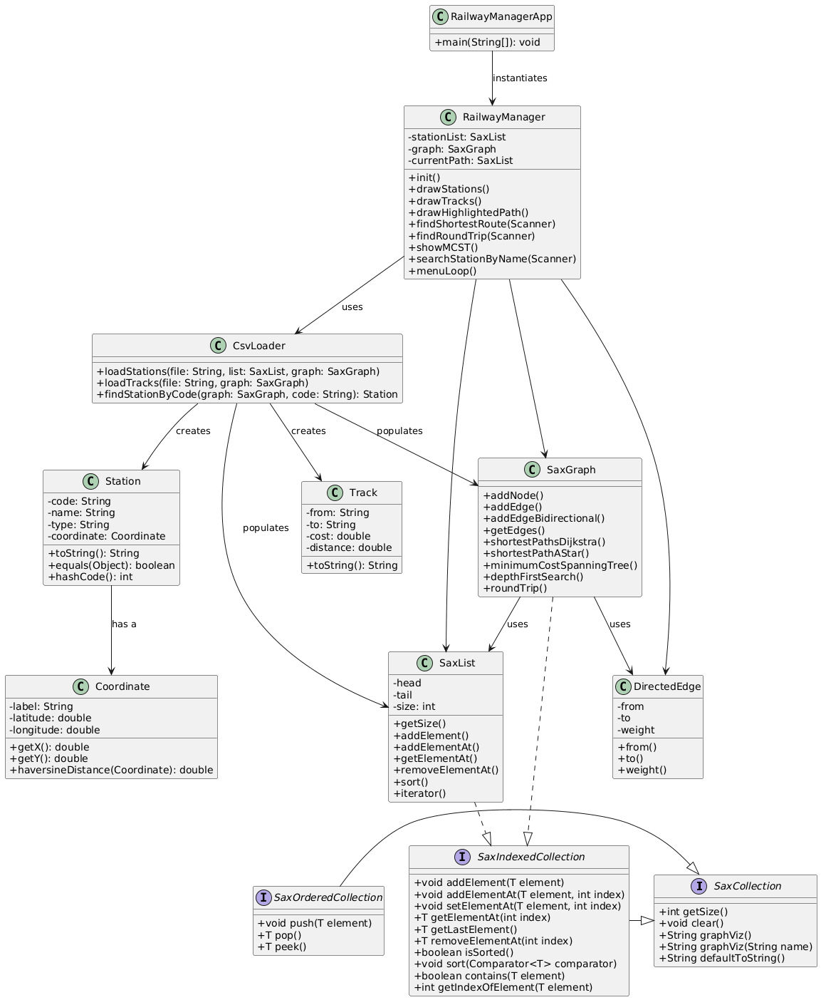

# Railway Track Manager Application – Documentation

**First & Last names:** Kiarash Delavar  

**Student Number:** 568403  

**Project:** Complex Data Structures (2025-2026) 

**Teacher:** Mr.Peter Ebben 

**Date:** 31/10/2025 


---

## ️ Application Structure

The application is **menu-driven** using the console and includes the following menu:

```
Railway Track Manager – MENU:
1. Search station by name
2. Find shortest route
3. Find shortest round trip
4. Show MCST
0. Exit
```

User chooses an option, and the result is **graphically displayed** using the SaxionApp drawing board. Every visual change, such as drawing routes or MCST, updates in real time.

Example Output:

**For Option 1 (Search station by name):**




**For option 2 (Find shortest route):**



**For option 3 (Find shortest round trip):**


**For option 4 (Show MCST):** 




---

##  SaxionApp GUI

All visuals are rendered on a SaxionApp canvas. Example:

- Red circles = stations
- Lines = railway tracks
- Blue path = shortest route
- Green or bold tracks = MCST

Drawing is handled inside the `RailwayManager` class using:
```java
SaxionApp.drawImage(...);
SaxionApp.drawCircle(...);
SaxionApp.drawLine(...);
```

---

##  Class Diagram Overview

The image below shows the structure of the application classes used in this project.



### Explanation:

- The diagram presents the class structure of the Railway Manager system.
- `SaxCollection` is the root interface implemented by both `SaxOrderedCollection` and `SaxIndexedCollection`.
- `SaxList` implements `SaxIndexedCollection`, providing indexed access and sorting.
- `Coordinate`, `Station`, and `Track` are core data classes used to model geographical data.
- `SaxGraph` manages graph-based algorithms (Dijkstra, A*, etc.) and uses `DirectedEdge` for edges.
- `CsvLoader` reads station and track data from CSV files and populates the graph and lists.
- `RailwayManager` controls the logic, drawing, and user interaction via console or GUI.
- `RailwayManagerApp` contains the `main` method and starts the application.

---

##  SaxCollection Classes Used

| Class | Purpose | Big-O Benefit | Reason |
|-------|---------|----------------|--------|
| `SaxList<T>` | Linked list for storing stations/tracks | O(1) insert/remove | Great for ordered data with flexible size |
| `SaxArrayList<T>` | Array-backed list | O(1) get, amortized insert | Used for index-heavy operations |
| `SaxHeap<T>` | Priority Queue | O(log n) insert/remove | Used in Dijkstra, Prim |
| `SaxGraph<V>` | Custom graph structure | Sparse graph support | Stores nodes/edges, supports algorithms |
| `SaxQueue<T>` | FIFO queue | O(1) enqueue/dequeue | Used in traversals |
| `SaxStack<T>` | LIFO stack | O(1) push/pop | Used in traversal/debugging |
| `SaxHashMap<K,V>` | Key-value map | O(1) avg lookup | Used for efficient key access |
| `SaxBinarySearchTree<T>` | Tree structure with AVL | O(log n) balanced ops | Optional, bonus for tree-based logic |

All are fully implemented **without using java.util** collections.

---

##  Testing

-  90%+ class, method, line, and branch coverage
-  JUnit 5 with `@Test`, `@BeforeEach`, and assertion methods
-  Good-weather and bad-weather testing
-  Exception coverage using `assertThrows(...)`
-  GraphViz methods excluded from coverage but invoked

 Example test classes:
- `TestSaxList` (you can run it from here and see results!)
- `TestSaxArrayList`
- `TestSaxHashSet` (you can run it from here and see results!)
- `TestSaxGraphAdvanced`

Example:
```java
assertThrows(NullNotAllowedException.class, () -> list.add(null));
System.out.println("Expected exception for null input");
```


---

#  Application classes:

# CsvLoader.java

[View Source Code](../../src/nl/saxion/cds/application/CsvLoader.java)

The `CsvLoader` class handles all the data-loading tasks at the beginning of the program execution. It reads station and track data from CSV resources and populates the internal data structures required by the rest of the Railway Track Manager application.

---

## Method: `loadStations(String resourceName, SaxList<Station> stationList, SaxGraph<Station> graph)`

This method loads all station data from the `stations.csv` file.

- It uses a buffered reader to parse each line.
- Each line is converted into a `Station` object (with code, name, type, and coordinates).
- The station is added to both a `SaxList` (to store a list of all stations) and a `SaxGraph` (to build the network of stations).

**SaxCollection classes used:**

- **`SaxList<Station>`**  
  Used to store all stations sequentially as they are read.
    - **Reason**: Allows flexible growth and is efficient for appending (`O(1)` for insertions).
    - **Alternative**: `SaxArrayList` could also be used for faster indexed access, but isn't necessary here because the list is only appended to and rarely accessed by index.

- **`SaxGraph<Station>`**  
  Used to represent the station network as a graph of nodes and edges.
    - **Reason**: Needed for Dijkstra’s and Prim’s algorithms. Supports sparse graph traversal and operations like `addNode()`.
    - **Alternative**: An adjacency matrix is not preferred due to high space complexity for sparse graphs.

---

## Method: `loadTracks(String resourceName, SaxGraph<Station> graph)`

This method loads all track (edge) data from the `tracks.csv` file.

- Each line is parsed to find source and destination station codes and distance.
- The method then looks up the matching `Station` objects inside the `SaxGraph` and adds edges between them.

**SaxCollection classes used:**

- **`SaxGraph<Station>`**  
  The graph structure is used to connect stations as nodes with weighted edges (distances).
    - **Reason**: Provides optimized methods like `addEdge(from, to, weight)` for modeling rail tracks.
    - **Alternative**: Could use a `SaxHashMap` of lists, but that would complicate traversal and would lack built-in graph functionality.

---

## Method: `findStationByCode(SaxGraph<Station> graph, String code)`

This is a helper method to find a station in the graph by its station code.

- Iterates over each node in the graph.
- Returns the `Station` that matches the given code.

**SaxCollection classes used:**

- **`SaxGraph<Station>` (iterator)**  
  Used to iterate over all stations in the graph.
    - **Reason**: Simple linear search over nodes (`O(n)`), which is acceptable due to the small number of nodes (397 total).
    - **Alternative**: A `SaxHashMap` could make this `O(1)`, but is unnecessary for such a small dataset and would add complexity.

 Overall, `CsvLoader` is a key utility class that bridges file I/O and graph construction using optimized SaxCollection structures.


---

# Coordinate.java

[View Source Code](../../src/nl/saxion/cds/application/Coordinate.java)

The `Coordinate` class represents a geographic coordinate with a label, latitude, and longitude.  
It is implemented as a **Java record**, which makes it immutable and ideal for representing fixed data such as the location of a railway station.  
This class is mainly used by the Railway Manager application to calculate distances between stations and to draw them accurately on the SaxionApp map.

---

##  Method: `haversineDistance(Coordinate to)`

**Purpose:**  
Calculates the distance in kilometers between two coordinates using the **Haversine formula**, which determines the great-circle distance between two points on Earth.

**How it works:**
- Converts both latitude and longitude to radians.
- Applies the Haversine trigonometric formula to compute the central angle.
- Multiplies by the Earth's radius (≈ 6371 km) to get the distance.
- Rounds the result to one decimal (hectometer) precision for simplicity.

**Usage in the project:**  
This method is primarily used by the `CsvLoader` and `RailwayManager` classes when calculating distances between railway stations for routes and graph edges.

**Complexity:**
- Time complexity: **O(1)** (fixed number of mathematical operations).
- Space complexity: **O(1)**.

---

##  Method: `getX()`

**Purpose:**  
Converts the longitude of the coordinate into an X-axis pixel value for the **768 px wide** map used in SaxionApp.

**How it works:**
- Scales the longitude value linearly between predefined `minLon` and `maxLon`.
- Ensures that the westernmost and easternmost stations fit visually within the map’s width.

**Reasoning:**  
This conversion allows each station to appear in the correct horizontal position on the rendered Netherlands map.

**Complexity:**
- **O(1)** since it performs a fixed set of arithmetic calculations.

---

##  Method: `getY()`

**Purpose:**  
Converts the latitude of the coordinate into a Y-axis pixel value for the **1024 px high** map used in SaxionApp.

**How it works:**
- Scales latitude values between `minLat` and `maxLat`.
- Inverts the scale so that northern stations appear higher on the screen (as they do on real maps).

**Reasoning:**  
This ensures correct vertical alignment of all stations when visualized on the SaxionApp graphical map.

**Complexity:**
- **O(1)** (fixed arithmetic operations).

---

##  Method: `toString()`

**Purpose:**  
Overrides the default `toString()` method to return only the **label** of the coordinate (e.g., “AMS” for Amsterdam).  
This simplifies debugging and station labeling when printing or drawing.

**Complexity:**
- **O(1)**.

---

####  Summary

| Method | Description | Used By | Complexity | Notes |
|--------|--------------|----------|-------------|-------|
| `haversineDistance()` | Calculates distance between two coordinates | `CsvLoader`, `RailwayManager` | O(1) | Uses Haversine formula |
| `getX()` | Converts longitude to pixel X value | `RailwayManager` | O(1) | Used for horizontal scaling |
| `getY()` | Converts latitude to pixel Y value | `RailwayManager` | O(1) | Used for vertical scaling |
| `toString()` | Returns the station label | `CsvLoader`, `SaxGraph` | O(1) | Simplifies text display |


**In summary:**  
`Coordinate.java` plays a key role in transforming geographical station data into graphical coordinates for rendering the Dutch railway network on screen.  
It ensures accurate placement of stations and realistic distance calculations, forming the foundation for both the visual and computational accuracy of the Railway Track Manager system.

---

# RailwayManager.java

[View Source Code](../../src/nl/saxion/cds/application/RailwayManager.java)


The `RailwayManager` class is the main application class that controls the railway track manager app. It uses the **SaxionApp GameLoop** for graphical rendering, and handles user input, drawing, and railway algorithms using the custom Saxion Collection Framework.

##  Class Overview

This class includes the following main components:
- Graph of all stations (`SaxGraph<Station>`)
- List of stations (`SaxList<Station>`)
- Station and track loading (`CsvLoader`)
- Interactive menu to search stations, find shortest routes, round trips, and show the MCST
- GUI rendering via `SaxionApp`

---

## `init()`

This method is called when the program starts. It loads stations and tracks from CSV files using the `CsvLoader`, and then starts a separate thread for the menu loop.

**SaxCollection used**:
- `SaxGraph<Station>`: to store the station network with connections (edges). It is ideal for representing the graph structure with efficient edge lookups and traversal (`O(V + E)`).
- `SaxList<Station>`: used to hold all station objects linearly.

## `menuLoop()`

Displays a menu in the terminal where the user can:
- Search a station
- Find shortest route
- Find round trip
- Show MCST

Each option calls a specific method to handle it.

## `searchStationByName(Scanner)`

Allows searching stations by name (or start of name), and visualizes the selected station on the map.

**SaxCollection used**:
- `SaxList<Station>`: stores matched stations. Linear search is used (`O(n)`) since names must be compared in order.

## `chooseStationFromSearch(String, Scanner)`

Used internally to help users pick one station when there are multiple matches for a name. It redraws the map and highlights matches.

**SaxCollection used**:
- `SaxList<Station>`: again used for storing matched stations.

## `findShortestRoute(Scanner)`

Finds the shortest route between two stations using Dijkstra’s algorithm and draws the route on the map.

**SaxCollection used**:
- `SaxGraph<Station>`: Dijkstra algorithm returns a new graph of shortest paths.
- `SaxList<DirectedEdge>`: Stores the path from start to end.
- `SaxArrayList<String>`: Stores station codes to avoid drawing them twice. `SaxArrayList` allows fast access by index.

## `buildPath(SaxGraph<Station>, Station, Station)`

Reconstructs the shortest path from the result of Dijkstra by tracing edges backward from end to start.

**SaxCollection used**:
- `SaxList<DirectedEdge>`: path is built by prepending edges.

## `findRoundTrip(Scanner)`

Finds the shortest round trip through multiple user-selected stations. It uses Dijkstra to find shortest paths between stations and generates all permutations to find the best route.

**SaxCollection used**:
- `SaxList<Station>`: stores input stations and permutations.
- `SaxList<SaxList<Station>>`: stores all possible routes.
- `SaxList<DirectedEdge>`: stores each route’s segments.

## `generatePermutations(...)`

Recursive helper function to generate all permutations of the station order (used for round trip).

**SaxCollection used**:
- `SaxList<Station>`: input list, current permutation, and result.

## `showMCST()`

Displays the minimum cost spanning tree (MCST) on the map using a light blue visual.

**SaxCollection used**:
- `SaxGraph<Station>`: returned by `minimumCostSpanningTree()`, which uses Prim’s or Kruskal’s algorithm internally.

## `drawStations()` and `drawTracks()`

Draws the red stations and gray track lines on the map.

**SaxCollection used**:
- `SaxList<Station>` for station drawing.
- `SaxGraph<Station>` for drawing edges.

## `drawHighlightedPath()`

Draws the currently selected route in blue, and station codes above it.

**SaxCollection used**:
- `SaxList<DirectedEdge>`: the selected path.
- `SaxArrayList<String>`: keeps track of already drawn codes.

## `isAlreadyDrawn(...)`

Checks manually if a station code is already drawn to avoid duplicates.

**SaxCollection used**:
- `SaxArrayList<String>`: linear search to check presence of code.


## Why These Collections?

- `SaxGraph`: perfect for graphs with nodes/edges. Dijkstra and MCST work naturally on this structure.
- `SaxList`: easy to use for ordered station lists, search results, or permutations. Simpler than arrays.
- `SaxArrayList`: chosen where fast index access matters (e.g., station code duplication).

Alternatives like `SaxSet` or `SaxHashMap` were not used because:
- Order matters (so `SaxList` is better than `SaxSet`).
- No key-value mapping is needed, so `SaxHashMap` would be unnecessary.


**this Class provides a fully working console+GUI-based railway route planner using graphs, lists, and search algorithms with simple Java code.**

---

# RailwayManagerApp.java

[View Source Code](../../src/nl/saxion/cds/application/RailwayManagerApp.java)

This file is the **entry point** for the Railway Track Manager application.

It uses **SaxionApp** to start a graphical interface with a game loop.


##  Code Overview

```
package nl.saxion.cds.application;

import nl.saxion.app.SaxionApp;

/**
 * Entry point for the Railway Track Manager application.
 * Now using SaxionApp.startGameLoop() for graphics.
 */
public class RailwayManagerApp {
    public static void main(String[] args) {
        SaxionApp.startGameLoop(new RailwayManager(), 768, 1024, 5);
    }
}
```


##  Explanation

- `RailwayManagerApp` is the **main class** of the program.
- It starts the **SaxionApp Game Loop**, which creates a window and keeps the app running.
- `new RailwayManager()` is passed to the loop to handle what to show and how to interact.
- The window is **768 pixels wide** and **1024 pixels high**.
- The last number `5` is the update speed (frames per second).

This class is very short, because all logic is handled in the `RailwayManager` class.


##  Why it's here

Every Java application needs a `main(...)` method.  
This file gives the command to launch the full railway system with a visual map and menu.

---

# Station.java

[View Source Code](../../src/nl/saxion/cds/application/Station.java)

This Java record class represents a **train station** in the Railway Track Manager project.

##  Package
```java
package nl.saxion.cds.application;
```

##  Purpose
The `Station` class stores basic details about a train station and provides methods to compare and display station data. It is a simple data container used in the railway network graph.

##  Fields
```java
String code        // Unique station code (e.g. "UT" for Utrecht)
String name        // Full station name (e.g. "Utrecht Centraal")
String type        // Type of station (e.g. "main", "regional")
Coordinate coordinate // The geo-coordinate (latitude/longitude) of the station
```

##  Static Field
```java
public static final SaxGraph.Estimator<Station> HAVERSINE_ESTIMATOR
```
A reusable **estimator** function used for A* or other graph algorithms. It uses the **Haversine formula** to estimate distance between two stations based on their coordinates.

##  Methods

### `equals(Object obj)`
Overrides the default equality method to compare stations **by their code only**, not by full name or coordinates.

### `hashCode()`
Overrides the default hash code to match the `equals()` behavior – based only on the station code.

### `toString()`
Returns a short readable string like:
```
Utrecht Centraal(UT)
```

##  Example
```java
Station s = new Station("UT", "Utrecht Centraal", "main", new Coordinate("UT", 52.09, 5.11));
System.out.println(s); // Utrecht Centraal(UT)
```
---

#  Conclusion:

The Railway Track Manager project was developed as part of the **Complex Data Structures.**

It combines file handling, graph algorithms, and a visual interface using **SaxionApp** to create an interactive and educational system for managing railway networks.

###  Learning Outcomes
Throughout this project, I gained strong practical experience in:

- Designing and implementing **custom data structures** (`SaxList`, `SaxGraph`, `SaxHeap`, etc.)
- Applying **graph algorithms** such as Dijkstra’s and Prim’s to real-world datasets
- Using **Big-O analysis** to justify structure choices
- Building a **menu-driven console system** combined with a **graphical interface**
- Performing **unit testing** with 90%+ method, line, and branch coverage using **JUnit 5**
- Integrating file I/O, collections, and visualization into a cohesive system

These skills strengthened my understanding of both algorithmic efficiency and clean software design.

###  Technical Summary
The project includes:
- Custom implementations of **Saxion Collection Framework** data structures
- A **CSV loader** for reading station and track data
- A **graph-based model** to represent and process the Dutch railway system
- A **console-driven UI** for user interactions
- A **real-time graphical view** rendered using `SaxionApp`

Each component was carefully designed and documented with explanations of complexity, purpose, and alternative design considerations.

###  Use of AI Assistance
During development, I used **AI as a learning assistant** to improve clarity, verify algorithms, and refine documentation.  
AI was not used to write the full implementation but rather to **support understanding and improve presentation quality**.  
This approach helped me gain deeper insight into complex algorithms and maintain a professional standard of documentation.

---

 ## **Final Remarks:**  
This project demonstrates the effective use of **custom-built data structures and algorithms** in a **realistic, interactive Java application**.  

It successfully fulfills the CDS course objectives  combining **efficiency, usability, and visualization** into a complete educational product.

---

## Note: 
If the **resources** folder has not marked as a **Resources root**, please marked it as Resources root otherwise loading pictures and csv files wouldn't work! 
